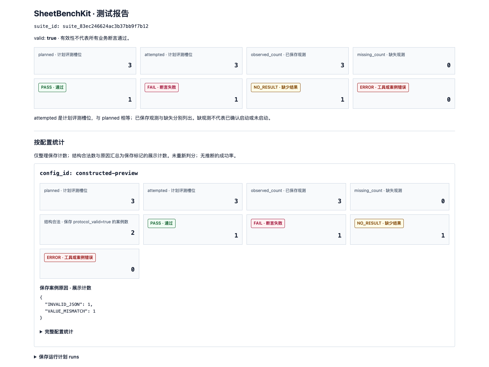

# Report preview / 报告预览

This example shows how SheetBenchKit displays a correct answer, a wrong answer, and text without a valid JSON result. The inputs are synthetic. **Every saved output was constructed for this preview; no adapter process or AI provider was run to create the observations.** This is a report demonstration, not a model benchmark.

这份预览用于展示正确答案、错误答案和无有效 JSON 结果三种情况。输入均为合成数据，保存的输出是专门构造的示例，没有启动适配器或调用 AI 模型，不能用来评价模型能力。



## What is in the example

The frozen suite reuses three unchanged cases from the project's reviewed synthetic preset, without family checks. Their gold retains the existing independent AI review and exact-arithmetic provenance; it does not claim individual human signatures.

| Case | Synthetic task | Constructed saved output | Expected report |
| --- | --- | --- | --- |
| S01 | Read `target.xlsx`, sheet `Actual`, cell A2: amount 100 units. Another file contains a distractor. | Protocol-valid value `100` with the required binding. | PASS: value and declared binding match. |
| R23 | Compute the ratio of column totals: 91 / 110, rounded to four places. | Protocol-valid value `0.5000` with the correct declared bindings; gold is `0.8273`. | FAIL: `VALUE_MISMATCH`; bindings still pass. |
| N17 | A CSV amount contains a nonnumeric literal; the frozen expectation is ABSTAIN / `INVALID_VALUE`. | Plain demonstration text instead of a JSON result. | NO_RESULT: `INVALID_JSON`; value and bindings are not checked. |

The `constructed-preview` configuration label is only a label. In [observations.json](examples/report-preview/observations.json), `runtime_metadata.observation_origin` explicitly says `constructed_saved_output`. The saved `execution_status: "SUCCESS"` selects the result-parsing branch for the demonstration; it is not evidence that a process actually ran. `usage` is null for all three records, so tokens and cost remain unknown. A passing binding proves only that the output declared the required source, not that an agent read it.

## Reproduce offline

First install the project using the [README](../README.md) or [中文说明](../README.zh-CN.md). Run the following from the repository root in that environment:

```sh
python -m sheetbenchkit validate --suite docs/examples/report-preview/suite
python -m sheetbenchkit grade --suite docs/examples/report-preview/suite --observations docs/examples/report-preview/observations.json --output ../sheetbenchkit-preview
```

**Expected exits: `validate` = 0; `grade` = 1.** The nonzero grade is intentional because the preview includes FAIL and NO_RESULT. The report has three planned slots, three saved observations, one PASS, one FAIL, one NO_RESULT, zero ERROR, and no family checks. This does not indicate an installation problem.

Open `../sheetbenchkit-preview/report.html` in a browser and inspect the same directory's `report.json` for machine-readable evidence. The grader starts no adapter and needs no API key or network access.

For Windows PowerShell, use the environment's executable directly from the repository root:

```powershell
.\.venv\Scripts\python.exe -m sheetbenchkit validate --suite docs/examples/report-preview/suite
.\.venv\Scripts\python.exe -m sheetbenchkit grade --suite docs/examples/report-preview/suite --observations docs/examples/report-preview/observations.json --output ../sheetbenchkit-preview
$LASTEXITCODE
```

A wheel installation includes the toolkit but not repository `docs/`. Wheel users must also clone the repository or extract the matching source archive to obtain these saved examples. Copying the whole `docs/examples/report-preview/` directory elsewhere works as well: its frozen inputs and references use paths relative to the suite, not machine-specific absolute paths. Pass the moved suite and observations paths to the same `grade` command.

## Files to inspect

- [suite.json](examples/report-preview/suite/suite.json): hashes and three frozen case references.
- [observations.json](examples/report-preview/observations.json): the constructed outputs and their explicit origin.
- [report.json](examples/report-preview/report.json): the report generated by the real grader.
- [report.html](examples/report-preview/report.html): the self-contained HTML report used for the screenshot. GitHub displays its source; download it or reproduce it locally to view the rendered page.

To freeze your own reviewed CSV/XLSX cases, continue with the [custom-case tutorial](custom-cases.md). To interpret all verdicts and planned denominators, read [benchmark semantics](benchmark.md).
